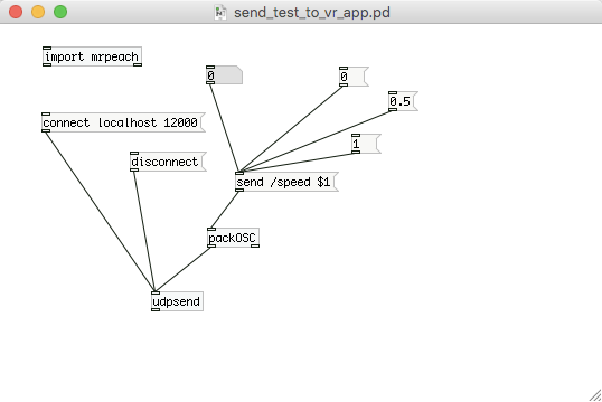
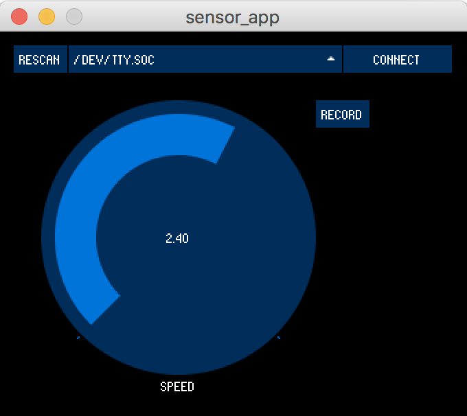

# Desktop sensor

This sensor connects to a desktop/laptop using USB. A processing application reads the serial port and sends out OSC messages. In addition changes in speed can be recorded in processing and saved to a comma seperated file.

Two pd patches are used to debug the OSC messages.

## making the sensor

The sensor is intended to be used on a machine and counts the revolutions. The RMP is tuned so that it results in a speed value in m/s.

I use these two components but practically all arduinos that have a USB connector should work.

IR reflectance sensor https://www.sparkfun.com/products/9542
trinket m0 https://www.adafruit.com/product/3500

## sensor firmware

The sensor will count the time between revolution. We use the Adafruit Trinket m0.

https://learn.adafruit.com/adafruit-trinket-m0-circuitpython-arduino/arduino-ide-setup

## processing sensor app

This app requires the latest processing https://processing.org and the controlP5 and oscP5 libraries.

Select a serial port and connect to the Arduino. Once connected the speed values from the sensor should stream in. 
Without a connection, the "knob" or the a and d keys can be used to decrease and increase the speed. 

