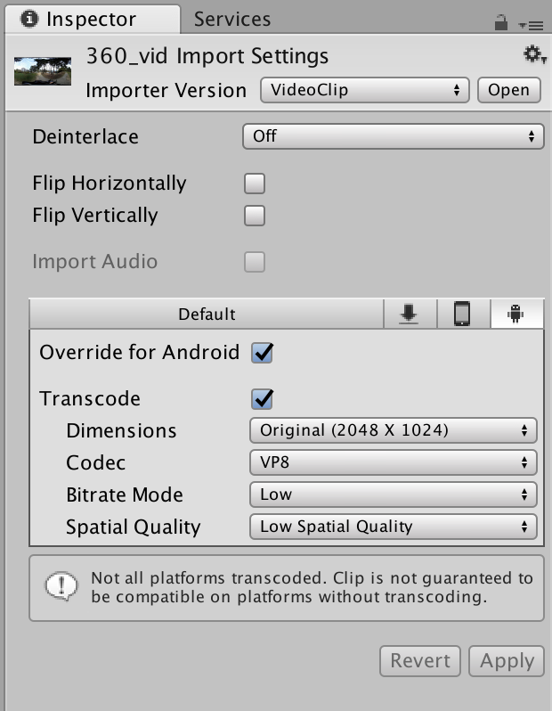
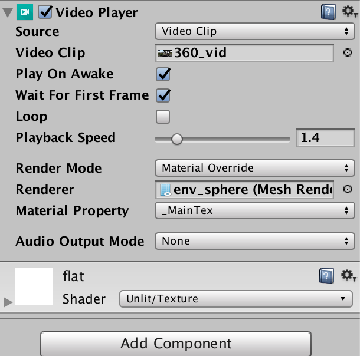

# Cardboard Version

This version is build for the Google VR API and is tested with Android. The folders "gvr_unity_project" "VR 360 Video Test" are working unity project, but in order to make it work you need to:

1) open the project in Unity
2) import the google GVR SDK for unity. This should make a folder "GoogleVR" in your assets folder
https://github.com/googlevr/gvr-unity-sdk/releases
3) download a 360 movie and put it in the "movies" subfolder.
the example file works with this movie:
https://drive.google.com/open?id=1KUaFk0oRK0KpHv8LEW2CHw7jK2iK8sTR

Note that both the movies and googleVR are excluded in the .gitignore at the root of each project.

# Working with 360 movies.

For the best result (within Unity) transcode the video for android. Depending on the phone lower the settings.

The movie is played in the video player that is attached to an inside out sphere "env_sphere". In the video player you specify which movie and can also set the speed.

# Controlling Speed

The speed of the movie can be controlled with the BLE sensor or with OSC and the USB sensor.

